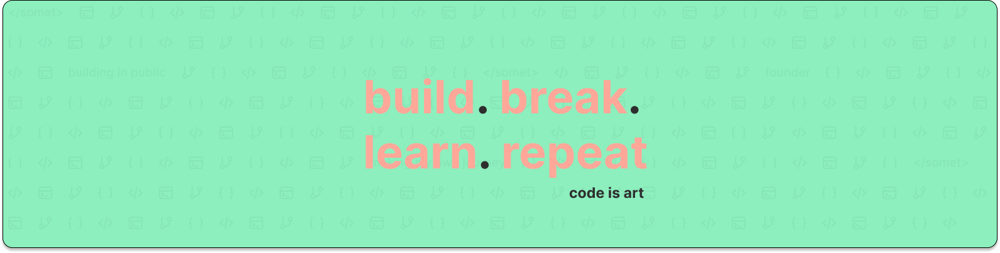

# Hey, I'm Yatin Sharma Madduri 👋

# 💫 About Me:
👨‍💻 About Me  🔭 I’m currently working on Building scalable full-stack applications as an SDE Intern, working across modern frontend and backend technologies to deliver production-ready software.  👯 I’m looking to collaborate on Full-stack or backend-focused projects, open-source contributions, and real-world applications using React, Node.js, TypeScript, PostgreSQL, Docker, and Kafka.  🤝 I’m looking for help with Strengthening system design, backend architecture, and preparing for SDE-1 / Backend / Full-Stack Engineer roles, with a long-term goal of moving into AI & ML.  🌱 I’m currently learning Advanced backend development, scalable system design, event-driven architectures, and gradually building foundations in AI & Machine Learning.  💬 Ask me about Full-stack development, backend engineering, REST APIs, PostgreSQL, Docker, Git/GitHub workflows, and transitioning from ECE to software engineering.  ⚡ Fun fact When I’m not coding, I enjoy listening to music, working out to stay fit, watching anime, and practicing meditation to stay focused and balanced.

## 🌐 Socials:
      

# 💻 Tech Stack:
                            
# 📊 GitHub Stats:
 
 

## 🏆 GitHub Trophies

### ✍️ Random Dev Quote

### 🔝 Top Contributed Repo

---

<!-- Proudly created with GPRM ( https://gprm.itsvg.in ) -->
